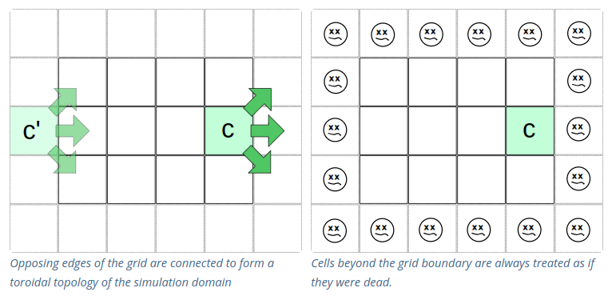

# CONWAY'S GAME OF LIFE

## Basics

* Every cell interacts with its eight neighbors, which are the cells that are horizontally,
vertically, or diagonally adjacent.

#### Boundry Conditions[*](./README.md?plain=1#L74)

"Cellular automata often use a toroidal topology of the simulation domain. This means that 
opposing edges of the grid are connected. The rightmost column is the neighbor of the leftmost 
column and the topmost row is the neighbor of the bottommost row and vice versa. This 
allows the unrestricted transfer of state information across the boundaries."

"Another type of boundary condition treats nonexisting cells as if they all had the same state. 
In the Game of Life this would mean that nonexisting cells are treated as if they were dead (as 
opposed to the second state "alive"). The advantage of this boundary condition in the Game of 
Life is that it prevents gliders from wrapping around the edges of the simulation domain. This 
will prevent the destruction of a glider gun by the gliders it produces (see text below below 
for details about what gliders are)." 

## RULES**

1. Any live cell with fewer than two live neighbors dies, as if by underpopulation.
2. Any live cell with two or three live neighbors lives on to the next generation.
3. Any live cell with more than three live neighbors dies, as if by overpopulation.
4. Any dead cell with exactly three live neighbors becomes a live cell, as if by reproduction.

-----

### Coordinate System   
                             
    (-x,-y)     |y   (+x,-y)     
                |                
                |           
                |             
    x           |              
    -----------------------   
                |              
                |              
                |                 
                |              
    (-x,+y)     |    (+x,+y)   
    
---

### TODO

* [ ] Create variables for the page Height and width, and MIN and MAX values for both x and y axis.
* [ ] Remember that you need to wait until all neighbors are checked before adding or removing cells.
* [x] Add in grid system [*reference](https://www.udemy.com/course/qt-c-gui-development-intermediate/learn/lecture/15986408#questions/21803686)
    * [x] Edit grid so that it has thicker lines every 10(?) lines.
* [x] Add Zoom feature [*reference](https://www.udemy.com/course/qt-c-gui-development-intermediate/learn/lecture/15986418#questions/21803686)
* [ ] Remove Stop button and make Start button change states depending on if the game is running or stopped.
* [ ] Create math to calculate how many grid lines to draw (look in view.drawForeground())
* [ ] Figure out how to detect neighbors.
* [ ] Look at QFileDialog and implement a way to save and load files [*reference](https://www.udemy.com/course/qt-c-gui-development-intermediate/learn/lecture/14324186#questions&t=5m)
* [ ] Make viewLayout editable
    1. One option would be to click on cell, which would open up a new window where you can edit.
    2. Another option (possibly the easiest way), would be to just make the view itself editable.
* [ ] Create a menu with a bunch of predefined starting shapes. [*reference](https://www.udemy.com/course/qt-c-gui-development-intermediate/learn/lecture/15509896#questions)
    * This might be too hard, but you could click and drag said shape from the list of values (with pictures)
    and place them right in the scene.
    * Could also just make a cell selectable, than when you click on the predefined shape it will appear with
    the selected cell being the upper left corner.

-----

### Resources

[*Belt of Orion](https://beltoforion.de/en/game_of_life/)  
[**Wikipedia](https://en.wikipedia.org/wiki/Conway%27s_Game_of_Life)  
[***GOL Simulator](https://playgameoflife.com/)
